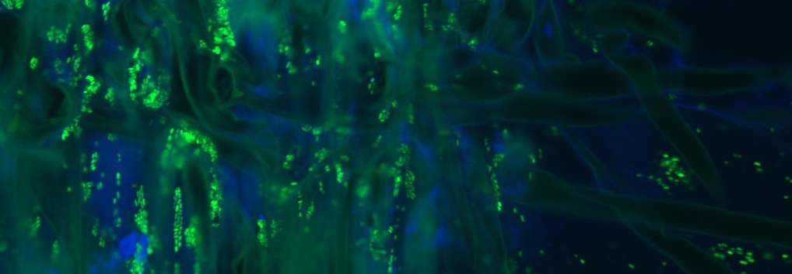

## Papers

- **Liber JA**, Minier DH, Stouffer-Hopkins A, Van Wyk J, Longley R, Bonito G. (2020) Leaf litter fungal communities reflect pre-senescent leaf communities in a temperate forest ecosystem. Fungal Ecology. *Under Review*.

- **Liber JA**, Bryson A, Bonito, G, Du Z. (2020) [Harvesting microalgae for food and energy products](https://onlinelibrary.wiley.com/doi/abs/10.1002/smtd.202000349). Small Methods. 2020(2000349): 1-16. [PDF](/pdfs/smtd.202000349.pdf)

- Vande Pol N, **Liber JA**, Matlock J, Bonito, G. (2020) *Mortierella elongata* stimulates aerial growth, seed production, and responses to auxin, ethylene, and reactive oxygen species in *Arabidopsis thaliana*. Molecular Plant Microbe Interactions. *Submitted*.

- Vande Pol N, **Liber JA**, Desirò A, Na H, Kennedy M, Barry K, Grigoriev IV, Miller AN, O’Donnell K, Stajich JE, Bonito G. (2020) Resolving the Mortierellaceae phylogeny through synthesis of Multi-Locus Sequence Typing (MLST) and phylogenomics. Fungal Diversity. *Under Review*.

- Aime MC, Urbina H, **Liber JA**, Bonito G, and Oono R. (2018) [Two new endophytic Atractiellomycetes, <i>Atractidochium hillariae</i> and <i>Proceropycnis hameedii</i>.](https://www.tandfonline.com/doi/abs/10.1080/00275514.2018.1446650) Mycologia. 110(1): 136146 [PDF](/pdfs/Two new endophytic Atractiellomycetes Atractidochium hillariae and Proceropycnis hameedii.pdf)

- Desirò A, Hao Z, **Liber JA**, Benucci GM, Lowry D, Roberson R, Bonito G. (2018) [<i>Mycoplasma</i>-related endobacteria within Mortierellomycotina fungi: diversity, distribution and functional insights into their lifestyle.](https://www.nature.com/articles/s41396-018-0053-9) The ISME journal. 12(7): 1743-1757. [PDF](/pdfs/Mycoplasma-related endobacteria within Mortierellamycotina fungi diversity distribution and functional insights into their lifestyle.pdf)

## Presentations
-   **Liber JA**, Golematis N, Cole E, Malmstrom C, Bonito G. (2019) [Four-way interactions in the plant holobiont: How does plant viral disease alter fungal and bacterial community assembly?](/pdfs/MSA_poster_2020.pdf) Mycological Society of America. Virtual, July. 22, 2020. Poster presentation.

- **Liber JA**, Bonito G. (2019) [Do fungal endophytes facilitate colonization of bacterial endophytes in <i>Brachypodium distachyon</i>?](/pdfs/Julian_MSA2019_poster.pdf) Mycological Society of America. University of Minnesota, Minneapolis, Minnesota, Aug. 13, 2019. Poster presentation.

- **Liber JA**. (2019) Co-inoculation effects of bacterial and fungal endophytes in <i>Brachypodium distachyon</i>. University Undergraduate Research and Arts Forum. Michigan State University, East Lansing, Michigan, Apr. 5, 2019. Oral presentation.

- **Liber JA**, Lee J, Uhelski E, Del Rose A, Schultz J, Viola S, Gate C, and Caldwell S. (2018). [Transformation of endophyte <i>Enterobacter ludwigii</i> with ACC deaminase related to ethylene stress response.](/pdfs/2018_iGEM_Jamboree_Poster_UPDATED_Liber.pdf) iGEM Giant Jamboree. Hynes Convention Center, Boston, Massachusetts, Oct. 25, 2018. Poster and oral presentation.

- **Liber JA**, Gall E, Vande Pol N, Silvia D, and Bonito G. (2018). [Use of hyphal image analysis and machine learning to classify Mucoromycota soil fungal isolates.](/pdfs/IMC11_Poster_Liber.pdf) International Mycological Congress. San Juan Convention Center, San Juan, Puerto Rico, July 20, 2018. Poster presentation.

- **Liber JA**, Gall E, Vande Pol N, Silvia D, and Bonito G. (2018). [Use of hyphal image analysis and machine learning to classify Mucoromycota soil fungal isolates.](/pdfs/UURAF18_Poster.pdf) University Undergraduate Research and Arts Forum. Michigan State University, East Lansing, Michigan Apr. 13, 2018. Poster presentation.

## Press

- **Liber JA**, Brauer-Delaney B. (2018). [Julian Liber: Undergrad research opportunities.](https://msutoday.msu.edu/360/2018/julian-liber-undergrad-research-opportunities/) MSU Today Student Views. Dec. 5, 2018.

- **Liber JA**, Houwat I. (2018) [MSU team wins bronze at 2018 synthetic biology competition.](https://research.msu.edu/msu-team-wins-bronze-at-2018-synthetic-biology-competition/) Michigan State University, Molecular Plant Sciences News. Nov. 27, 2018.
